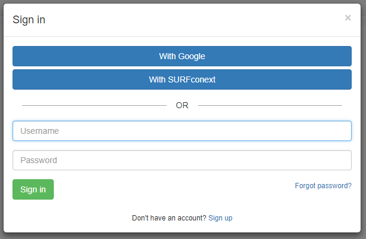

# Setup authentication

In case data is access controlled, you need to authenticate yourself. In MOLGENIS you can sign in using three methods.
 * Username/password sign in
 * Single sign-on
 * Token-authentication

# Username/password sign in
The default way to authenticate in MOLGENIS is to click 'Sign in'. You can register a new account by using the 'Sign-up'-link. If there is no 'Sign-up'-link, you'll have to contact the administrator to register an account.
>note: If you want to use reCaptcha when you enable 'Sign up' then you can configure that [here](guide-settings.md).  

## Two-factor authentication
If you have an existing MOLGENIS-account you can secure it with two-factor authentication, depending on the server's settings.

**prompted:** Two-factor authentication cannot be combined with single sign-on

When two-factor authentication is enabled and you sign in for the first time, you will be promted to secure your account with an authenticator app. The authentication can be configured by scanning a QR-code.


You have to scan the QR-code with an authenticator-app. Examples of authenticator-apps are:

 * **Android**
   * [Google Authenticator](https://play.google.com/store/apps/details?id=com.google.android.apps.authenticator2)
   * [Authy](https://play.google.com/store/apps/details?id=com.authy.authy)
   * [DUO](https://play.google.com/store/apps/details?id=com.duosecurity.duomobile&hl=nl)
 * **iPhone**
   * [Google Authenticator](https://itunes.apple.com/app/google-authenticator/id388497605?mt=8)
   * [Authy](https://itunes.apple.com/app/authy/id494168017?mt=8)
   * [DUO](https://itunes.apple.com/app/duo-mobile/id422663827?mt=8)

When the QR-code is scanned, your authenticator-app will create an account for MOLGENIS and also generate a verification code for that account.
You have to fill in the verification code in de box below the QR-code. If you have entered the verification code you will be redirected to the
*Account-Security*-tab. This will show the recovery-codes.


Make sure you store the recovery codes somewhere (not in MOLGENIS) so you can access them when you for example lose your phone.
Each time you sign in, you will have to enter the verification code.


Depending on the server's settings, you can enable, disable and reset your two-factor authentication in your account settings (under Security).

## TROUBLESHOOTING  
When you have lost your phone or misplaced it, you have to use one of the recovery codes to unlock your account. You can view your recovery codes
in the *Account-Security*-tab. Make sure to store the recovery codes somewhere outside MOLGENIS. You can click on the 'Enter a recovery code'-link,
in the screen where you have to enter the verification code. You can then enter the recovery code to unlock your account.

# Single sign-on
In addition to username/password authentication MOLGENIS supports authentication with identity providers that support [OpenID Connect](https://openid.net/connect/)
such as [Google](https://developers.google.com/identity/protocols/OpenIDConnect) and [SURFconext](https://wiki.surfnet.nl/display/surfconextdev/OpenID+Connect+reference).

Once enabled the sign in dialog will display additional sign in options:



Selecting e.g. Google will redirect the browser to their website so the user can authenticate there and return to MOLGENIS once authentication has successfully completed.
The permissions you have once authenticated are the default user permissions set by an administrator.   

## Configuring single sign-on   
As administrator single sign-on configuration consists of the following one-time steps:
1. Register MOLGENIS with the ID providers
2. Configure one or more OpenID Connect clients, one for each identity provider
3. Modify the authentication settings, activating clients for the identity providers.

### Registering MOLGENIS with an ID provider
Your MOLGENIS server needs to be registered with the identity provider as a client.
The identity provider typically has a web interface where you can do this.

*  A `client ID` and a `client secret` are issued by the identity provider and used
by MOLGENIS to authenticate with the provider.
*  The provider will typically also ask you how it can validate the
`redirect URI`.
The redirect URI is an endpoint on the MOLGENIS server: 
`https://<serverURL>/login/oauth2/code/<registrationID>`
The registration ID is an ID that you assign to the provider when you register the
OIDC client.
*  Since the user will be authenticating with the ID provider in the browser,
the provider may allow you to add some branding to the login page,
such as a logo or styling.

### Registering an ID provider with MOLGENIS
MOLGENIS uses an OpenID Connect client to communicate with the ID provider.
OpenID Connect clients can be configured by adding entities to the 'OIDC client' entity type (e.g. using the data explorer, importer or REST API).

#### Registration ID
This is the registration ID that ends up in the redirect URI on the MOLGENIS server.

#### Client ID and secret
You need to fill in the client ID and client secret that you got from the ID
provider.

#### Client name
How the end user sees the identity provider.
This becomes the label on the button on the login page.

#### Issuer URI
The identity provider specifies a set of endpoints where the user and MOLGENIS
can interact with the provider.
If you configure the Issuer URI, MOLGENIS will use it to
[discovery](https://openid.net/specs/openid-connect-discovery-1_0.html) most of the
OpenID Connect configuration for you.
If your provider does not provide a discovery URL, or if you want to provide different
values, leave the issuerURI empty.

Here's the issuerUri for some providers you could connect to:

| provider | issuerUri |
| --- | --- |
| Auth0         | `https://<realm>.auth0.com/`            |
| Google        | `https://accounts.google.com`           |
| Keycloak      | `https://<server>/auth/realms/<realm>`  |
| MITRE (perun) | `https://<server>/oidc/`                |
| MOLGENIS Auth | `https://auth.molgenis.org`             |
| SURFConext    | `https://connect.surfconext.nl/`        |

#### Roles claim
You can provide a json path that will be evaluated on the combined claims
of the id token and the response of the user info endpoint.
The roles in this claim, prefixed with `ROLE_` will be added to the user's roles
when they log in.

#### VO groups claim
Users can be managed remotely by the ID provider in a virtual organisation (VO).

You can provide a json path (typically `eduperson_entitlement`), that will be evaluated on the combined claims
of the id token and the response of the user info endpoint.
The values in this claim will be added to the VO group table.
In the Security Manager, group managers can grant roles on their group to
VO group members. VO Group members will be granted these group roles when
they log in.

#### Scopes and claims
By default, MOLGENIS will request all scopes found in discovery.
If you want to request fewer scopes, leave the Issuer URI empty.

MOLGENIS requires at least the `sub` and `email` claims and ideally the `given_name`
and `family_name` claims as well.
These claims are requested by specifying the scopes `openid,email,profile`.

#### Endpoints
By default, MOLGENIS will use the endpoints found in discovery.
If you want to finetune the endpoints, or if your identity provider does not support
discovery, leave the Issuer URI empty and fill in the endpoints by hand.
They can often be found in the documentation or provided by the administrator of the
identity provider.

### Activating OpenID Connect clients
The OpenID Connect clients you have created in the previous step can now be selected in the
'Authentication settings' part of the 'Settings manager' plugin.

> N.B. Only the clients that have been created in entity 'OIDC client' can be selected.

Activating clients requires 'Allow users to sign up' to be set to 'Yes' and 'Sign up moderation' to be set to 'No'.


### Beware of time skew between the servers
The authentication tokens from the ID provider are signed with a timestamp.
If the server times are skewed, token validation may fail.
Activating [NTP](https://nl.wikipedia.org/wiki/Network_Time_Protocol) will help fix this. 

### Advanced: OpenID Connect user to MOLGENIS user mapping
When a user signs in through e.g. Google the user is automatically mapped to a MOLGENIS user based on the email address. If no MOLGENIS user exists
a new MOLGENIS user is created. The mapping from an OpenID client user to MOLGENIS user is persisted in the 'OIDC user mapping' entity type and can
be modified by an administrator if required. Multiple mappings to the same user are allowed such that when a user signs in with e.g. either a Google
and SURFconext account will be identified as the same MOLGENIS user.

#### How the OpenID Connect user is mapped to a MOLGENIS User:
> NOTE: The name of the claim used in this mapping to look up the email address is configurable in the
`<emailAttributeName>` attribute of the 'OIDC client' entity. By default it is the `email` claim.

1. The OpenID Connect user's claims are retrieved from the `userInfoUri` endpoint.
1. Verify that the OpenID Connect user has an `<emailAttributeName>` claim
2. If the OpenID Connect user has an `email_verified` claim,
    verify that, converted to boolean, it equals true
3. Look for an OidcUserMapping where
    - the `oidcClient` attribute equals the OidcClient's `registrationId`
    and
    - the `oidcUsername` attribute equals the OpenID Connect user's `sub` claim
4. If such a mapping is found, return the MOLGENIS User that this mapping refers to.
5. Otherwise: Search the MOLGENIS User table for a user
    whose `Email` attribute equals the OpenID Connect user's `<emailAttributeName>` claim.
6. If no such user exists: Create a new MOLGENIS User:
    1. username equals `<usernameAttributeName>` claim
        > The name of this claim is also configurable in the 'OIDC client' entity. The default
        is 'email'.
    2. random password
    3. email address equals the `<emailAttributeName>` claim
    4. active is true
    5. First name equals the `given_name` claim
    6. Middle names equals the `middle_name` claim
    6. Last name equals the `family_name` claim
7. Add an OidcUserMapping for the MOLGENIS User:
    1. Label equals <clientRegistration's registrationId>:<`sub` claim>
    2. OidcClient equals the oidcClient for the UserRequest
    3. oidcUsername equals the `sub` claim
    4. user equals the MOLGENIS User
8. Return the MOLGENIS User

## Token-authentication
When you use the REST API you have to authenticate using a token. There are 3 ways you can generate a token.
 * Create a token via the REST API v1 /login route (only available without two-factor authentication)
 * Create a token via the UI (e.g. DataExplorer)

### Create a token via REST API v1/login
When you create a POST request to v1/login you have to put the username and password in JSON in the body of the request.

```
{
  username: #username#,
  password: #password#
}
```

You can't login in via this route when two-factor authentication is enabled for the current user.

### Automatically generated token
When you run scripts in MOLGENIS a token is generated automatically with the credentials of the current user.

### Manually created token
When you want to manage your tokens manually there are different methods in MOLGENIS to do that. We now explore on of the ways
to create new tokens. You can create manually tokens in the DataExplorer. When you search on "*token*", you can edit the
existing tokens.


When you click on the add-button you can manually assign a token to a user. This token can be used to access the API's
of MOLGENIS.


