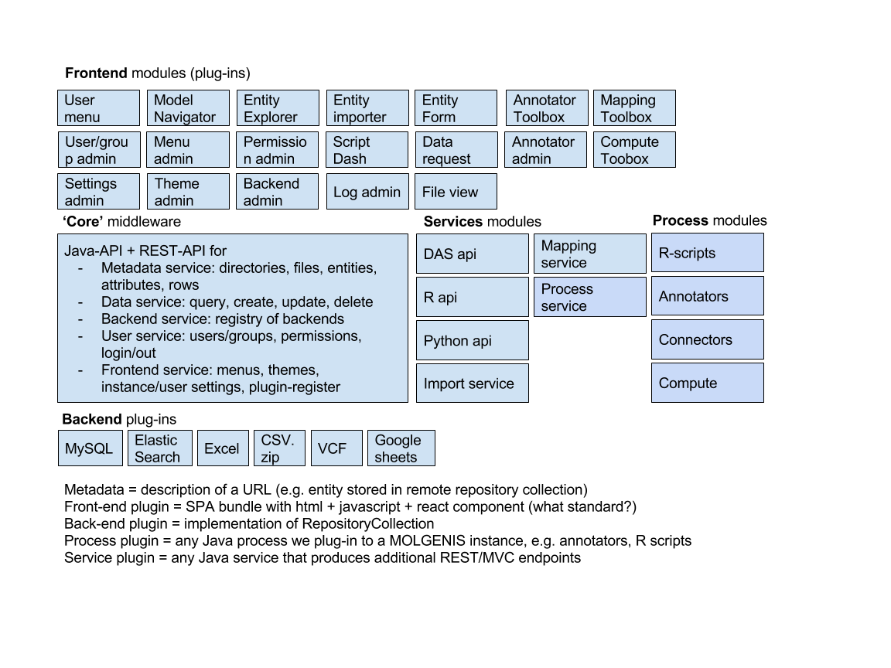

# RPM deployment
At the moment we support two OS variants.

- CentOS (6.x)
- RedHat (6.x)

There are currently two ways of installing MOLGENIS on the server. We use several building blocks to deploy MOLGENIS on servers.
The configuration is based upon RPM's which are used in Ansible to configure the deployment.

The architecture of MOLGENIS is displayed in the following figure.



## Add repositories
You need to add the repository to access the RPM's:

Add these files to ```/etc/yum.repos.d```

**molgenis.repo**

```bash
[molgenis]
name=MOLGENIS releases repository
baseurl=https://registry.molgenis.org/repository/yum-releases/
enabled=1
protect=0
gpgcheck=0
metadata_expire=30s
autorefresh=1
type=rpm-md
```

**elasticsearch.repo**

```bash
[elasticsearch-5.x]
name=Elasticsearch repository for 5.x packages
baseurl=https://artifacts.elastic.co/packages/5.x/yum
gpgcheck=1
gpgkey=https://artifacts.elastic.co/GPG-KEY-elasticsearch
enabled=1
autorefresh=1
type=rpm-md
```

**postgres.repo**

```
[pgdg11]
name=PostgreSQL 11.1 $releasever - $basearch
baseurl=https://download.postgresql.org/pub/repos/yum/11/redhat/rhel-$releasever-$basearch
enabled=1
gpgcheck=0
```

Then type ```yum update```

## Install packages
Then you need to install the following artifacts:

- adopt-openjdk
- elasticsearch
- postgresql11-server
- minio
- tomcat
- molgenis
- httpd
- *optional* opencpu
  - opencpu-server
  - rapache
- *optional* python3

You can do this by typing this command: ```yum install #package name#```.

> note: the order of the packages is important. We do no have requirements set the right way.

## Configure packages
> note: install the above packages first!

### Postgres
You need to bootstrap the database with this snippet in PSQL:

```bash
CREATE DATABASE molgenis;
CREATE USER molgenis WITH PASSWORD 'molgenis';
GRANT ALL PRIVILEGES ON SCHEMA molgenis TO molgenis;
```

In the ```pg_hba.conf``` You need to update to these lines:

```bash
# TYPE  DATABASE        USER            ADDRESS                 METHOD

# "local" is for Unix domain socket connections only
local   all             all                                     peer
# IPv4 local connections:
host    all             all             127.0.0.1/32            md5
# IPv6 local connections:
host    all             all             ::1/128                 md5
# Allow replication connections from localhost, by a user with the
# replication privilege.
#local   replication     postgres                                peer
#host    replication     postgres        127.0.0.1/32            ident
#host    replication     postgres        ::1/128                 ident
```

In the `postgres.conf` you need to update these lines:

```bash
max_locks_per_transaction = 1024
```

Restart the service.

### Elasticsearch
Open ```elasticsearch.yml``` in the Elasticsearch config directory and set the following properties:

```bash
cluster.name: molgenis
node.name: node-1
indices.query.bool.max_clause_count: 131072
```

In the ``` /etc/security/limits.conf``` update this line:

```bash
elasticsearch  -  nofile  65536
```

Add this this file in ```/etc/sysctl.d/99-elasticsearch.conf``` with the following content.

```bash
vm.swappiness=1
```
Restart the service.

### Configure Tomcat
After you install Apache Tomcat you first need to install MOLGENIS before you start the service.

### Configure HTTPD
We use proxy passes to expose Tomcat through Apache. You can use this file as template to expose your MOLGENIS instance.
Create the file in ```/etc/httpd/conf.d/```

**molgenis.conf**

```
<VirtualHost molgenis.your-domain.ext:80>

    ServerAdmin admin@molgenis.your-domain.ext

    ServerName molgenis.your-domain.ext
    ServerAlias molgenis.your-domain.ext

    RewriteEngine on
    RewriteCond %{SERVER_NAME} =molgenis.your-domain.ext
    RewriteRule ^ https://%{SERVER_NAME}%{REQUEST_URI} [NE,R=permanent]

</VirtualHost>

<VirtualHost molgenis.your-domain.ext:443>

    ServerAdmin admin@your-domain.ext

    ServerName molgenis.your-domain.ext
    ServerAlias molgenis.your-domain.ext

    SSLProxyEngine on
    RewriteEngine on

    RewriteRule ^/@molgenis-ui/app-manager/(.+)         /@molgenis-ui/app-manager@0.1.4/$1 [P]
    RewriteRule ^/@molgenis-ui/core-ui/(.+)             /@molgenis-ui/core-ui@0.3.1/$1 [P]
    RewriteRule ^/@molgenis-ui/legacy-lib/(.+)          /@molgenis-ui/legacy-lib@1.1.2/$1 [P]
    RewriteRule ^/@molgenis-ui/data-row-edit/(.+)       /@molgenis-ui/data-row-edit@3.0.5/$1 [P]
    RewriteRule ^/@molgenis-ui/metadata-manager/(.+)    /@molgenis-ui/metadata-manager@0.1.8/$1 [P]
    RewriteRule ^/@molgenis-ui/navigator/(.+)           /@molgenis-ui/navigator@0.1.3/$1 [P]
    RewriteRule ^/@molgenis-ui/one-click-importer/(.+)  /@molgenis-ui/one-click-importer@0.1.4/$1 [P]
    RewriteRule ^/@molgenis-ui/questionnaires/(.+)      /@molgenis-ui/questionnaires@2.0.5/$1 [P]
    RewriteRule ^/@molgenis-ui/scripts/(.+)             /@molgenis-ui/scripts@2.0.2/$1 [P]
    RewriteRule ^/@molgenis-ui/search-all/(.+)          /@molgenis-ui/search-all@0.1.4/$1 [P]
    RewriteRule ^/@molgenis-ui/security/(.+)            /@molgenis-ui/security@0.2.0/$1 [P]
    RewriteRule ^/@molgenis-ui/settings/(.+)            /@molgenis-ui/settings@2.0.2/$1 [P]
    RewriteRule ^/@molgenis-ui/data-explorer/(.+)       /@molgenis-ui/data-explorer@0.35.0/$1 [P]
   
    ProxyRequests Off
    ProxyPreserveHost On

    # proxy frontend
    ProxyPass /@molgenis-ui https://unpkg.com/@molgenis-ui
    ProxyPassReverse /@molgenis-ui https://unpkg.com/@molgenis-ui

    # proxy backend
    ProxyPass / http://localhost:8080/
    ProxyPassReverse / http://localhost:8080/

    RequestHeader set X-Forwarded-Proto "https"
    RequestHeader set X-Forwarded-Port "443"

    SSLEngine On

    SSLCertificateFile /etc/pki/tls/certs/**#your cert#**.crt
    SSLCertificateKeyFile /etc/pki/tls/private/**#your key#**.key
    SSLCertificateChainFile /etc/pki/tls/certs/**#your server-chain#**.crt

</VirtualHost>
```

Restart the service.
