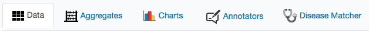
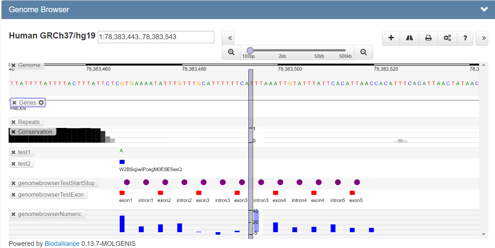

# Using the dataexplorer

The data explorer allows to select tables (aka EntityType or 'entity') and view, edit, filter and download their contents, assuming you have the right permissions.

## Choose a table
At the top left corner of the data explorer, the name of the currently selected table is shown, as well as the description (if given).

At the top right corner, a dropdown (entity select) is shown which can be used to select the table you wish to display.
For admins, a delete button is shown at the right side of the  select. Clicking it will allow you to choose if you only want
to delete the data or also want to delete the metadata for the currently selected table.


## Search, Find and Filter
In the upper left corner of the data explorer, below the name of the entity, a search box is shown.
This search box can be used to search all your data for a certain search term.


Directly below the search box, the currently active attribute filters are shown.
They can be edited by clicking on them. The cross trailing can be used to delete the currently used filter(s).
Filters can be set from the attribute selection tree which is described below.
Using the checkbox in front of each attribute, the visibility of this attribute in the table can be managed.
The filter icon can be used to set filters for this specific attribute.


In the area with the active filters, you will also find the button to open the filter wizard.
This is a popup screen that allows you to add filters for different attributes in one go.


Any filters you use are stored in the URL as an RSQL query. This allows you to bookmark pages with certain columns and filters selected inside a specific table.
For more information on RSQL operators, you can take a look at our [RSQL operator](guide-rsql.md) documentation.

## Add, Edit, Update, Delete

Click the edit icon and change the chromosome from 7 to 8 and save.
Adding a row works the same way, only without the prefilled fields.
Now, let's click the red garbage bin icon in front of a line to delete this line from the entity.

TODO: add figure

## Switch views



The data explorer consists of multiple modules to view or process the data in different ways. These modules are described below:

### Data table view
The data module shows the data in a table. This table can be sorted by clicking on the headers.
If your data contains references to other entities, an icon is shown to expand this reference to show the data from the referenced entity.

Every line starts, depending on your permissions, with some action icons:


- Add row:
Using this button, a form will open with input for all the attributes in the entity, allowing you to create a new row.
All fields will be validated based on their datatype. For example, "test" is not a valid email address.
- Edit row:
Same as the add row button, but with prefilled inputs to allow you to edit a row.
- Inspect row:
This button will open a form with a custom made report for this row. With the right permissions, different reports can be created using the FreemarkerTemplate entity.
- Delete row:
This button can be used to remove a row from the entity.

### Report view

Optionally, custom reports can be available for the selected table. 

The reports functionality is made for overriding the default instance view or to add an instances tab in the Data-explorer. Overriding the views or adding a tab is possible by creating a new `FreemarkerTemplate` entity with the right name convention. This short tutorial will show you how to achieve this.

There are two ways to create your own reports:

1. Overriding the default instance view.
2. Add one or more instances view tabs.

You will need:

1. Create a test group
2. Create a user; e.g. *Manager*
3. Assign the user to the group with a manager-role
4. Login as Manager
5. Import a data set: "Advanced data example" ([download](./data/advanced_data_example_v20171206.xlsx)), using the "Advanced importer", see the [Import guide](guide-data-import.md).

###### Override the entity view

Steps:

1. Go to the Data Explorer.
2. Select the "cities" entity via the entity select dropdown.
3. The entity view modal is opened when you click on the }\</div>"`
    
6. Repeat steps 2 and 3.
7. The new view will be: 

###### Add an instances view tab
1. Go to the data explorer and select the "cities" entity through the entity select dropdown.
2. Let's upload our own template.
	1. Go to the data explorer and select the FreemarkerTemplate entity.
	2. Click on the  button. In the modal you fill in:

Name: `view-Cities-entitiesreport.ftl`

Value:

```html
<link rel="stylesheet"
      href="//cdnjs.cloudflare.com/ajax/libs/leaflet/0.7.7/leaflet.css"/>

<div id="map" style="width: 600px; height: 400px"></div>

<script>
    function showMap() {
        var map = L.map('map').setView([38, -80], 4);

        L.tileLayer('//api.tiles.mapbox.com/v4/{id}/{z}/{x}/{y}.png?access_token=pk.eyJ1IjoibWFwYm94IiwiYSI6IjZjNmRjNzk3ZmE2MTcwOTEwMGY0MzU3YjUzOWFmNWZhIn0.Y8bhBaUMqFiPrDRW9hieoQ', {
            maxZoom: 18,
            attribution: 'Map data &copy; <a href="http://openstreetmap.org">OpenStreetMap</a> contributors, ' +
            '<a href="http://creativecommons.org/licenses/by-sa/2.0/">CC-BY-SA</a>, ' +
            'Imagery &copy; <a href="http://mapbox.com">Mapbox</a>',
            id: 'mapbox.streets'
        }).addTo(map);

    <#list datasetRepository.iterator() as city>
        L.marker([${city.get("lat")},${city.get("lng")}]).addTo(map)
                .bindPopup("${city.get("cityName")}").openPopup();
    </#list>
    }
    $.getScript("//cdnjs.cloudflare.com/ajax/libs/leaflet/0.7.7/leaflet.js", showMap);
</script>
```


3. Click on the settings icon 
	1. Check: Modules -> Data -> Reports -> `Yes`
	2. Set: Reports -> Reports -> `test_cities:Cities`
	   * test_citites is the entity name.
	   * Cities is the template name.

	
4. Refresh the page and repeat step 1.
5. The result:


### Aggregation view

The aggregation module allows you to produce aggregated counts for queries on the data.

The screen has 2 areas, the controls and the results. The controls allow you to choose the attributes you wish to use for the aggregation.


Youcan select 1 attribute for simple one dimensional counts, represented as a table with one column, or two attributes to get a 2 dimensional aggregate table.
A third dropdown allows you to select an attribute by which to group the results.


These functionalities are best explained by the example in the "try it out section below".

## Download  

At the bottom right of each table, there is a download button. This button allows you to save the data to a CSV or XLSX file. The XLSX download is limited to 500000 values to prevent performance issues.
Depending on the purpose of the download, identifiers or labels can be used as column headers.

## Genome browser



MOLGENIS provides genome browsing using the[Dalliance](https://www.biodalliance.org/)genome browser.

If the genome browser should be shown at all in a MOLGENIS instance, the browser can be configured via the data explorer settings.

By default entities containing attribute combinations specified in the "GenomeBrowser Attributes" table are shown.
It is possible to add/remove or update those entities to change which entities should show the genome browser.

It is also possible to add specific configuration for an entity by adding a row in the "GenomeBrowser Settings" table:

**Label**	a human readable label for the configuration.

**Entity**	the entity for which this is the configuration

**Genomic attributes**	reference to the "GenomeBrowser Attributes" row that should be used for this dataset

**Label Attribute**	the attribute that should be used as a label in dalliance

**Track type**	the type of track, choice from:
- VARIANT: tracks are shown in letters (alternative allele), stars (if more than one alternative allele) or dots (indels)
- EXON: tracks are shown in white(intron) and red(exon) blocks with an label
- NUMERIC: tracks are shown as a histogram for every row

**Exon/intron key**	keyword to distinguish between exons and introns based on the label value, if the keyword is avaialble we assume it is an exon

**Score attributes** attribute name of the column containing the value that should be used for a numeric track 	

**Feature popup attributes**   attributes that should be shown in the dalliance feature popup, format: attributename:label,attributename,label	 

**Reference track mode**	 
If additional molgenis datasets should be shown in the genome browser when this one is selected, possible values:
- ALL: all tracks that qualify to be shown in the browser are shown
- CONFIGURED: additional tracks are configure in the "molgenis_reference_tracks"
- NONE: no additional molgenis tracks will be shown

**Reference tracks**	The other tracks that should be shown if this one is selected, this is a reference to other "GenomeBrowser Settings" rows

**Actions**	Javascript functions to be added to the dalliance feature popup. Actions are executed when the link in the feature popup is clicked. Actions should be provided in an javascrip object with 'label' (which will be used as the link) and 'run', example: *[{label:"action1" run:"alert('action1')"},{label:"action2" run:"alert('action2')"}]*.

**feature_info_plugin**	Javascript code that will be added within the function fot the featureInfoPlugin option.  
The function itself is provided by MOLGENIS: `function(f, info) {CONFIGURED_CODE_WILL_BE_ADDED_HERE}`

More information on the "featureInfoPlugin" functionallity can be found [here](http://www.biodalliance.org/plugins.html).

** **

### Try it out

#### Example - data for genome browser

Upload the [vcf_example_file](./data/Documentation_VCF.vcf "VCF example file") using the importer.
Let's select an entity containing genomic variants, by selecting the entity name you just chose for the upload in the entity select.
Let's assume we have a specific location we are interested in, say position 103214569 at chromosome 7. We'd like to search for that specific line in the entity.
Let's first use the search box to see if we can find the line that way:
enter "103214569" in the search box and press enter.

But now we like to take a look at all variation on chromosome 7. As you can imagine searching for "7" in all the attributes in the data, will give us a lot of results we are not looking for. So we'd like to filter for this value specifically for the chromosome attribute.

Click on the filter icon in front of "#CHROM" in the attribute selection tree, and enter "8" in the input field. Then click "apply".
However, we meant to search for chromosome 7, so let's click the filter in the active filters box, and change the value to 7.
We now have all the values for chromosome 7 in the table, however, the results are divided over several pages of results. We'd like to view them all in one screen; click the "rows per page" dropdown below the table, and select "100". This will show 100 results per page.
The "FILTER" column shows the same value for every line. Since we are not interested in this column, let's hide it by clicking the checkbox in front of "#CHROM" in the attribute selection tree.

Click any column header in the table to sort the data based on that column, click again to sort in the opposite direction.
Click one of the lines in the table to zoom to the position of this variant in the genome browser.
Click the symbol in front of the "SAMPLES" column header to show the columns belonging to the samples.

Click the magnifying glass in front of the data line, to show a report for that line. The default report just shows all attribute values in a structured way. However, as stated above, all kinds of reports can be added at runtime.

#### Example - with data from Excel
Upload [emx_example_file](./data/Documentation_EMX.xlsx "EMX example file") through the importer.
Navigate to the data explorer and select the aggregates tab. Select the just uploaded "biobanks" entity.

Now select "patientid" in the entity dropdown.
You now get a 1 dimensional list of counts, showing you that every patient has 3 entries in the selected entity.

Now select "biobank" in the first aggregate dropdown, and in the second select "sampletype".
You now get a table representing the amount of samples in both biobanks per type.

Finally, select "patientid" in the third dropdown, the distinct attribute.
The table will update to show you how many patients with at least one sample of a specific type are available in a biobank.

## Data Explorer v2 (Experimental)

The data explorer can be used to explorer the data.

#### Enabling the data explore v2 
The data explorer v2 can be set as the default data explorer by removing the data-explorer (v1) plugin from the menu.
Selecting an item in the navigator will then open the item in the data explorer v2.

The data explorer v2 can be added to the (main)menu via a redirect plugin: 
- Open the menu-manager
- In de section 'Create a new menu item'
  - Select ```redirect``` as plugin type
  - Choose a name ( for example: 'Dataexplorer')
  - Paste a link to app as the queryString
```url=%2F@molgenis-ui%2Fdata-explorer%2Fdist%2Findex.html```
  - Add the item to the menu 
	
### Data explorer v2 features

#### Table actions are accessible using the toolbar
(hover over the buttons to view action labels).
- Add button: The add button allows the user to add a new row to the table (only visible if user has 'ADD_DATA' rights).
- Search input:  Allows the user to search the entire table.
- Order by dropdown: Allows user to oder the data by a given field ( clicking the button reverses the order)
  - for quick access clicking on the column header labels sort the table by that column.
  - a second click reverses the sort order
- Show/Hide columns: Can be used to hide (and unhide) columns (or card fields)
- Download button: Downloads the table as an exel file
- View selector: Toggle between card or grid view
- Settings: (only visible as admin) opens up table settings form

#### Card view and custom cards
Data explorer v2 has the ability to show data as a grid of cards or as a data table ( similar to data explorer v1).


##### Card view with default card
By default each card shows a list show as a list of label / value pairs. Each item in the list is a column in the data table.
The number of items show can be configured using the table settings.


#### Custom card layout

The card display can be customised by adding a template to the table settings.

Take for example the table describing a list of books, the default card looks like this:

Default card:


By adding a template its display can be customised.


Template:
```
<h1>{{record.label}}</h1>
<p>by {{record.author.label }}</p>
```

Customised card:


A template can contain any valid vue template code, this includes valid html and styling.

### Per Table Data Explorer Settings

Each data table can be associated with a settings item.
A settings item configures the way the data explorer behaves for a given table.

Settings a stores in the system table: ``sys_ts_DataExplorerEntitySettings``

Each row in this table contains the settings for a single data table. If no settigns a given the default settings are used. The table contains the following settings fields:

- Table - (required) a reverence to the table that uses these settings
- Card template - a custom template used to render the card 
- Is shop - indicates if a card/row can be select ( added to a selection)
- Template attributes - list of comma separated table fields to be used in the template
- Collapse limit - number of fields that a initialy show on the default cards
- Default filters - list of comma separated table fields that a show a filters 

The settings table can be readed from the dataexplorer by selection the setting action in the toolbar (or via the navigator or using emx).
