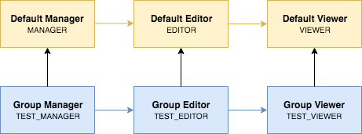

# Groups and roles

## Groups
Groups allow people to work together in MOLGENIS.
When you create a new root package, e.g. using the importer,
a group will automatically be created for the package.
Vice versa, every group you create in the security UI gets a
root package to put resources in.

You can view and manage groups and group membership in MOLGENIS
by navigating to **Admin --> Security Manager**.

### Creating a group
> you need to be superuser to create a group

1. Click on the **Add group**-button.
2. Fill out the necessary field and click on **Create**.

### Deleting groups

1. Clicking the group on the overview screen to see the details.
2. Click the delete button (recycle bin icon) to delete the group.

When deleting a group the package, groups specific roles and group memberships
are deleted as well.

## Roles
A role is a job function within the context of a group granting certain
permissions on resources in that group.

When a new group is created, the following default group roles are created
with the following permissions:

**Manager**:
* Can manage the memberships in the group
* Gets access to the following plugins:
  * Import Data
    * Advanced importer
    * One click importer
  * Navigator
  * Data Explorer
  * Plugins
    * Search all
    * Job overview

**Editor**:
* Can edit data in the group
* Gets access to the following plugins:
  * Import Data
    * Advanced importer
  * Navigator
  * Data Explorer
  * Plugins
    * Search all
    * Job overview
    * Questionnaires

**Viewer**:
* Can view data in the group
* Gets access to the following plugins:
  * Navigator
  * Data Explorer
  * Plugins
    * Search all
  
These three default roles are hierarchical, so a group member with role Editor also gets
all permissions that role Viewer grants.
  
> If needed, a superuser can configure these permissions differently or
> different group roles can be created.

# Local user membership
Users can be made a member of a group in a role.
The creator of a group automatically becomes a member of that group with
the role Manager.

## Add a user to a group
Superusers and group Managers can add local users to a group by making them
a member of a group role.

1. In the groups overview, click on a group to select it
2. Click on **Add member**
3. Select a member from the **User-pulldown** and select the **role** that the member
should get in the group. Click on **Add member**

## Update a group member's role

You can update the role of a group member.
1. Click on a member to go to the member details view.
2. Click on "Edit" to update the role and click on "Update role".

## Remove a member from a group
1. Click on a member to go to the member details view.  
2. Click on "Remove from group".

# Remotely managed VO groups

Identity providers such as Elixir AAI and Surf SRAM allow users from different institutes to
organize themselves in a virtual organisation (VO).
VO members can be grouped into VO groups.

Group membership information [can then be shared with service providers](https://aarc-project.eu/wp-content/uploads/2017/11/AARC-JRA1.4A-201710.pdf)
such as MOLGENIS, typically in the `eduperson_entitlement` claim in the
User Info endpoint.
A system administrator can configure this in the OIDC client configuration for
the ID provider by setting the `Claims VO Group path` attribute.
MOLGENIS will add all VO Group claims it encounters to the VO Group table.

## Add a VO Group to a group
Remote VO Groups can be made a member of a local MOLGENIS group in a group role.
When someone logs in and the ID provider has stated that they are a member of
that VO group, they are granted that role for the duration of their session.

This membership can be managed just like that of local users using the Security Manager.

# Roles and inclusion
MOLGENIS comes with three default roles out of the box: Manager, Editor and Viewer. When you add a Group, the three group roles
that are added actually include (or inherit) these default roles. That's how you get all those permissions on plugins
listed above automatically. 

The default roles include each other as well. The Editor can see and do everything a Viewer can, and some more. The Manager 
can see and do everything the Editor can, and some more. System admins can change the permissions of these roles, so that 
certain plugins and functionality can be turned on or off across the system for all groups. Some examples:
1. As the admin, you don't want any user to use the Search All plugin. You achieve this by removing the Search All plugin permission
from the `VIEWER` role. 
2. As the admin, you only want Managers and Editors to use the Navigator. You achieve this by removing the Navigator plugin permission
from the `VIEWER` role, and giving the `EDITOR` role `VIEW` permission to the Navigator plugin.

*For more information on how to give permissions to roles, read up on the [Permission Manager](guide-permissions.md)*

The group roles include each other as well, in the same manner as the default roles. Your group's Manager can see and do 
everything your group's Editor can, etc. See the following schematic for an overview of how all the roles connect for a group 
that has been aptly named 'test':

The group roles do not contain any permissions when you first create them; they only include the default roles. However, 
just like with any other role, you can still add permissions to them. This setup gives you fine grained control, especially
when your MOLGENIS hosts multiple groups. Some examples:

1. You want all the users in your group to see a special plugin that's not relevant for other groups. You achieve this by
giving the `TEST_VIEWER` role `VIEW` permission on that plugin.
2. You don't want all Editors in the system to see the Job Overview plugin. You achieve this by removing that plugin permission 
from the default Editor role and adding it to your group's Editor role. Now both the Editors and Managers in your group can use it, 
but from now on any new group that's added won't have these permission by default.

Even though you'll find that the default settings are sufficient most of the time, you have complete control over all the roles and
permissions in the system if you ever wish to change something.
