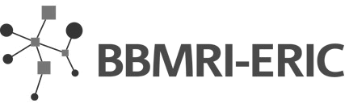
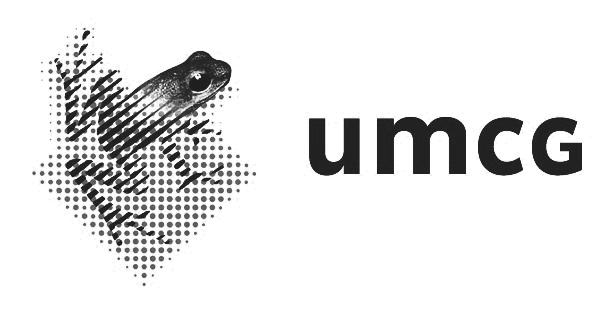
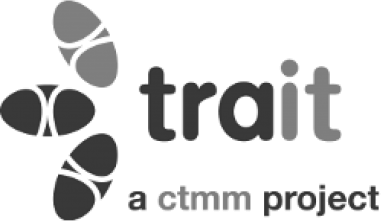
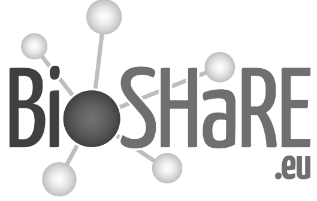

# GCC - UMCG

Primary MOLGENIS support is currently coordinated by the <a href="http://wiki.gcc.rug.nl">Genomics Coordination Center</a> (GCC) hosted at the <a href="http://geneticsgroningen.nl/">Dept of Genetics of University Medical Center Groningen</a>. GCC provides hosting of MOLGENIS services, project based development and routine analysis.

Contact: Dr. Morris Swertz Dept. of Genetics, CB50 University Medical Center Groningen P.O. Box 30001 9700 RB  GRONINGEN The Netherlands

email: m.a.swertz@rug.nl

# BBMRI & TraIT

Also biobank research infrastructure BBMRI-NL and translational research infrastructure CTMM-TraIT provide hosting support for MOLGENIS.

More information at http://bbmri.nl and http://www.ctmm-trait.nl/

# Partners
MOLGENIS is used and financially supported by:

# Acknowledgements
MOLGENIS open source software development is supported by

