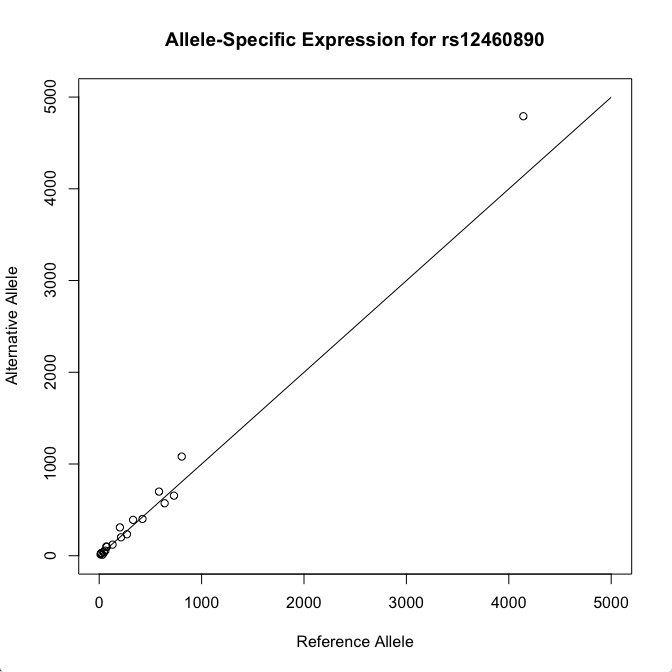

**
The R API is a script that allows access to your MOLGENIS data via the R-Project statistical package. It is available on every MOLGENIS on the URL `http://molgenis.mydomain.example/molgenis.R`.
**

**NOTE:** The MOLGENIS R-api client supports up to R-version 3.2.x

## Example
As an example, let's create a plot for publicly available ASE data available on https://molgenis56.target.rug.nl/. For a description of the data, take a look at [http://molgenis.org/ase](http://molgenis.org/ase).

Start up the R environment.

In the shell type:

```
library('RCurl')
eval(expr = parse(text = getURL("https://molgenis56.target.rug.nl/molgenis.R")))
```

This loads the R API from the molgenis56 server. If you take a look in your workspace by typing

```
ls()
```
you should see that a couple functions have been added for you to use:

```
 [1] "molgenis.add"                  "molgenis.addAll"               "molgenis.addList"              "molgenis.delete"               "molgenis.env"                
 [6] "molgenis.get"                  "molgenis.getAttributeMetaData" "molgenis.getEntityMetaData"    "molgenis.login"                "molgenis.logout"              
[11] "molgenis.update"     
```

Let's load some data from the server using `molgenis.get`:

```
molgenis.get("ASE")
```

This retrieves the top 1000 rows from the ASE entity.

```
P_Value Samples      SNP_ID Chr       Pos                           Genes
1    0.000000000000000020650473933963698652198164782417962682333833636491755847419682368126814253628253936767578125000000000000000000000000000000000000000000000000000000000000000000000     145   rs9901673  17   7484101 ENSG00000129226,ENSG00000264772
2    0.000000000000000008781097353981130661746700850633192724259771276345502150073585312384238932281732559204101562500000000000000000000000000000000000000000000000000000000000000000000     359   rs2597775   4  17503382                 ENSG00000151552
3    0.000000000000000001491745894983400057481059632909089858257546335023040629669255352496293198782950639724731445312500000000000000000000000000000000000000000000000000000000000000000     301      rs3216  11    214421                 ENSG00000177963
[...]
1000 0.000132500824069775005771554265976419628714211285114288330078125000000000000000000000000000000000000000000000000000000000000000000000000000000000000000000000000000000000000000000      47   rs1056019  12  41337435                 ENSG00000018236
```

Let's retrieve a specific SNP from the ASE entity:

```
molgenis.get("ASE", q="SNP_ID==rs12460890")
```

```
  Fraction_alternative_allele Likelihood_ratio_test_D Alternative_allele Reference_allele                P_Value Samples     SNP_ID Chr    Pos           Genes
1                       0.527                56.02079               TRUE                C 0.00000000000007170854      21 rs12460890  19 829568 ENSG00000172232
```

This SNP has a mild but significant allele-specific expression, based on expression counts in 21 samples.

Let's retrieve the samples for this SNP:

```
samples <- molgenis.get("SampleAse", q="SNP_ID==rs12460890")
print(samples)
```

```
       SNP_ID SampleIds Ref_Counts Alt_Counts Chromosome Position      ID
1  rs12460890 ERS194242        130        121         19   829568 1418785
2  rs12460890 ERS326942       4142       4791         19   829568 1418786
3  rs12460890 ERS327006         19         28         19   829568 1418787
4  rs12460890 SRS353551         19         23         19   829568 1418788
5  rs12460890 SRS271084         32         11         19   829568 1418789
6  rs12460890 SRS375020        639        572         19   829568 1418790
7  rs12460890 SRS375024        202        309         19   829568 1418791
8  rs12460890 SRS375022        423        401         19   829568 1418792
9  rs12460890 SRS375030        271        234         19   829568 1418793
10 rs12460890 SRS375026        806       1081         19   829568 1418794
11 rs12460890 SRS375027        213        201         19   829568 1418795
12 rs12460890 SRS376459         74         96         19   829568 1418796
13 rs12460890 SRS375032        730        655         19   829568 1418797
14 rs12460890 SRS376461        584        699         19   829568 1418798
15 rs12460890 SRS376464        331        391         19   829568 1418799
16 rs12460890 SRS376469         13         14         19   829568 1418800
17 rs12460890 SRS376467         70        101         19   829568 1418801
18 rs12460890 SRS376468         47         35         19   829568 1418802
19 rs12460890 SRS418748         19         28         19   829568 1418803
20 rs12460890 SRS418754         44         47         19   829568 1418804
21 rs12460890 SRS418755         60         55         19   829568 1418805
```

There they are.
Let's plot the expression counts in these samples in a scatter plot.

```
plot(samples$Ref_Counts, samples$Alt_Counts, xlim = c(0, 5000), ylim = c(0, 5000), xlab='Reference Allele', ylab='Alternative Allele', main = 'Allele-Specific Expression for rs12460890')
```

And add a line for the non-specific expression.

```
lines(c(0,5000), c(0, 5000))
```


# Query format

The query must be in [fiql/rsql format](https://github.com/jirutka/rsql-parser).

# Non-anonymous access
The ASE data from the previous example is publicly available.
To access private data, you can log in using

```
molgenis.login("your username", "your password")
```
This will create a molgenis token on the server and set it in the `molgenis.token` variable in your R workspace.

When you're done, you can log out using

```
molgenis.logout()
```

# Retrieving more rows
By default, `molgenis.get` will retrieve up to 1000 rows only.

If you need more rows, you can request up to 10000 rows by adding the `num` parameter:

```
molgenis.get("ASE", num=2000)
```
will retrieve the top 2000 rows from the ASE entity.

# Pagination
You can retrieve the data page-by-page.

```
molgenis.get("ASE", num=5)
```
will retrieve a first page of 5 rows and

```
molgenis.get("ASE", num=5, start=5)
```
will retrieve the second page of 5 rows.

# Cross server scripting
By default, the MOLGENIS R API retrieves its data from the server you retrieved it from, so if you want to retrieve data from a different server, simply source the molgenis.R from that server.

But if you want to combine data from multiple server, you can specify a different REST API URL to use by setting `molgenis.api.url` in the `molgenis.env` environment. For example:

```
local({
  molgenis.api.url <- "https://molgenis.mydomain.example:443/api/v1/"
}, env = molgenis.env)
```
or

```
local({
  molgenis.api.url <- "http://molgenis.mydomain.example:8080/api/v1/"
}, env = molgenis.env)
```