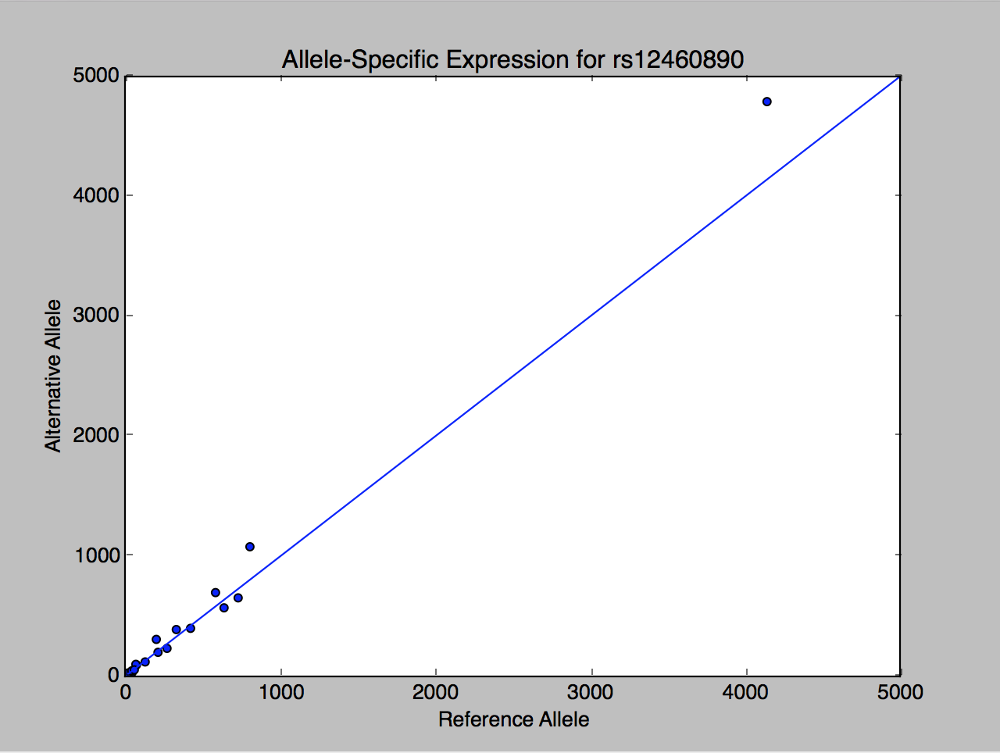

**
The Python API is a script that allows access to your MOLGENIS data from python. It is available on every MOLGENIS with version 1.14.0 and up on the URL `http://molgenis.mydomain.example/molgenis.py`.
**

#Example
As an example, let's create a plot for publicly available ASE data available on https://molgenis56.target.rug.nl/. For a description of the data, take a look at [http://molgenis.org/ase](http://molgenis.org/ase).

We'll be creating a scatter plot so if you haven't already, install matplotlib from the commandline:

```sh
pip install matplotlib
```

Download the python api from a molgenis server, for instance [https://molgenis01.target.rug.nl/molgenis.py](https://molgenis56.target.rug.nl/molgenis.py) and save it in `molgenis.py`.

Start an interactive python shell and create a molgenis connection:

```python
import molgenis
```
This imports the molgenis package.

```python
session = molgenis.Session("https://molgenis56.target.rug.nl/api/")
```
Instantiates a new `Session` pointing at the molgenis56 server. If you take a look at the connection by typing

```python
dir(session)
```
you should see, amongst others, the methods you can call:

```python
[...,'add', 'add_all', 'delete', 'get', 'get_attribute_meta_data', 'get_entity_meta_data', 'login', 'logout',...]   
```

Let's load some data from the server using `session.get`:

```python
session.get("ASE")
```
This retrieves the top 1000 rows from the ASE entity.

```python
[{u'Alternative_allele': u'A', u'P_Value': 2.06504739339637e-17, u'Genes': {u'href': u'/api/v1/ASE/rs9901673/Genes'}, u'Fraction_alternative_allele': 0.479, u'Pos': 7484101, u'Reference_allele': u'C', u'Chr': u'17', u'href': u'/api/v1/ASE/rs9901673', u'Samples': u'145', u'Likelihood_ratio_test_D': 72.0813644150712, u'SNP_ID': u'rs9901673'}, {u'Alternative_allele': u'T', u'P_Value': 8.78109735398113e-18, u'Genes': {u'href': u'/api/v1/ASE/rs2597775/Genes'}, u'Fraction_alternative_allele': 0.479, u'Pos': 17503382, u'Reference_allele': u'C', u'Chr': u'4', u'href': u'/api/v1/ASE/rs2597775', u'Samples': u'359', u'Likelihood_ratio_test_D': 73.769089117417, u'SNP_ID': u'rs2597775'}, {u'Alternative_allele': u'C', u'P_Value': 1.4917458949834e-18, u'Genes': {u'href': u'/api/v1/ASE/rs3216/Genes'}, u'Fraction_alternative_allele': 0.479, u'Pos': 214421, u'Reference_allele': u'G', u'Chr': u'11', u'href': u'/api/v1/ASE/rs3216', u'Samples': u'301', u'Likelihood_ratio_test_D': 77.2691957930797, u'SNP_ID': u'rs3216'}, [...],{u'Alternative_allele': u'T', u'P_Value': 0.000132500824069775, u'Genes': {u'href': u'/api/v1/ASE/rs1056019/Genes'}, u'Fraction_alternative_allele': 0.482, u'Pos': 41337435, u'Reference_allele': u'C', u'Chr': u'12', u'href': u'/api/v1/ASE/rs1056019', u'Samples': u'47', u'Likelihood_ratio_test_D': 14.605874945467, u'SNP_ID': u'rs1056019'}]
```
Let's retrieve a specific SNP from the ASE entity:

```python
print(session.get("ASE", q=[{"field":"SNP_ID", "operator":"EQUALS", "value":"rs12460890"}]))
```
```python
[{u'Alternative_allele': u'T', u'P_Value': 7.1708540619282e-14, u'Genes': {u'href': u'/api/v1/ASE/rs12460890/Genes'}, u'Fraction_alternative_allele': 0.527, u'Pos': 829568, u'Reference_allele': u'C', u'Chr': u'19', u'href': u'/api/v1/ASE/rs12460890', u'Samples': u'21', u'Likelihood_ratio_test_D': 56.0207947348388, u'SNP_ID': u'rs12460890'}]
```	
This SNP has a mild but significant allele-specific expression, based on expression counts in 21 samples.

Let's retrieve the samples for this SNP:
```python
samples = session.get("SampleAse", q=[{"field":"SNP_ID", "operator":"EQUALS", "value":"rs12460890"}])
print(samples)
```

```python
[{u'Ref_Counts': u'130', u'href': u'/api/v1/SampleAse/1418785', u'SampleIds': {u'href': u'/api/v1/SampleAse/1418785/SampleIds'}, u'Position': 829568, u'SNP_ID': {u'href': u'/api/v1/SampleAse/1418785/SNP_ID'}, u'Alt_Counts': u'121', u'ID': u'1418785', u'Chromosome': u'19'}, {u'Ref_Counts': u'4142', u'href': u'/api/v1/SampleAse/1418786', u'SampleIds': {u'href': u'/api/v1/SampleAse/1418786/SampleIds'}, u'Position': 829568, u'SNP_ID': {u'href': u'/api/v1/SampleAse/1418786/SNP_ID'}, u'Alt_Counts': u'4791', u'ID': u'1418786', u'Chromosome': u'19'}, {u'Ref_Counts': u'19', u'href': u'/api/v1/SampleAse/1418787', u'SampleIds': {u'href': u'/api/v1/SampleAse/1418787/SampleIds'}, u'Position': 829568, u'SNP_ID': {u'href': u'/api/v1/SampleAse/1418787/SNP_ID'}, u'Alt_Counts': u'28', u'ID': u'1418787', u'Chromosome': u'19'}, {u'Ref_Counts': u'19', u'href': u'/api/v1/SampleAse/1418788', u'SampleIds': {u'href': u'/api/v1/SampleAse/1418788/SampleIds'}, u'Position': 829568, u'SNP_ID': {u'href': u'/api/v1/SampleAse/1418788/SNP_ID'}, u'Alt_Counts': u'23', u'ID': u'1418788', u'Chromosome': u'19'}, {u'Ref_Counts': u'32', u'href': u'/api/v1/SampleAse/1418789', u'SampleIds': {u'href': u'/api/v1/SampleAse/1418789/SampleIds'}, u'Position': 829568, u'SNP_ID': {u'href': u'/api/v1/SampleAse/1418789/SNP_ID'}, u'Alt_Counts': u'11', u'ID': u'1418789', u'Chromosome': u'19'}, {u'Ref_Counts': u'639', u'href': u'/api/v1/SampleAse/1418790', u'SampleIds': {u'href': u'/api/v1/SampleAse/1418790/SampleIds'}, u'Position': 829568, u'SNP_ID': {u'href': u'/api/v1/SampleAse/1418790/SNP_ID'}, u'Alt_Counts': u'572', u'ID': u'1418790', u'Chromosome': u'19'}, {u'Ref_Counts': u'202', u'href': u'/api/v1/SampleAse/1418791', u'SampleIds': {u'href': u'/api/v1/SampleAse/1418791/SampleIds'}, u'Position': 829568, u'SNP_ID': {u'href': u'/api/v1/SampleAse/1418791/SNP_ID'}, u'Alt_Counts': u'309', u'ID': u'1418791', u'Chromosome': u'19'}, {u'Ref_Counts': u'423', u'href': u'/api/v1/SampleAse/1418792', u'SampleIds': {u'href': u'/api/v1/SampleAse/1418792/SampleIds'}, u'Position': 829568, u'SNP_ID': {u'href': u'/api/v1/SampleAse/1418792/SNP_ID'}, u'Alt_Counts': u'401', u'ID': u'1418792', u'Chromosome': u'19'}, {u'Ref_Counts': u'271', u'href': u'/api/v1/SampleAse/1418793', u'SampleIds': {u'href': u'/api/v1/SampleAse/1418793/SampleIds'}, u'Position': 829568, u'SNP_ID': {u'href': u'/api/v1/SampleAse/1418793/SNP_ID'}, u'Alt_Counts': u'234', u'ID': u'1418793', u'Chromosome': u'19'}, {u'Ref_Counts': u'806', u'href': u'/api/v1/SampleAse/1418794', u'SampleIds': {u'href': u'/api/v1/SampleAse/1418794/SampleIds'}, u'Position': 829568, u'SNP_ID': {u'href': u'/api/v1/SampleAse/1418794/SNP_ID'}, u'Alt_Counts': u'1081', u'ID': u'1418794', u'Chromosome': u'19'}, {u'Ref_Counts': u'213', u'href': u'/api/v1/SampleAse/1418795', u'SampleIds': {u'href': u'/api/v1/SampleAse/1418795/SampleIds'}, u'Position': 829568, u'SNP_ID': {u'href': u'/api/v1/SampleAse/1418795/SNP_ID'}, u'Alt_Counts': u'201', u'ID': u'1418795', u'Chromosome': u'19'}, {u'Ref_Counts': u'74', u'href': u'/api/v1/SampleAse/1418796', u'SampleIds': {u'href': u'/api/v1/SampleAse/1418796/SampleIds'}, u'Position': 829568, u'SNP_ID': {u'href': u'/api/v1/SampleAse/1418796/SNP_ID'}, u'Alt_Counts': u'96', u'ID': u'1418796', u'Chromosome': u'19'}, {u'Ref_Counts': u'730', u'href': u'/api/v1/SampleAse/1418797', u'SampleIds': {u'href': u'/api/v1/SampleAse/1418797/SampleIds'}, u'Position': 829568, u'SNP_ID': {u'href': u'/api/v1/SampleAse/1418797/SNP_ID'}, u'Alt_Counts': u'655', u'ID': u'1418797', u'Chromosome': u'19'}, {u'Ref_Counts': u'584', u'href': u'/api/v1/SampleAse/1418798', u'SampleIds': {u'href': u'/api/v1/SampleAse/1418798/SampleIds'}, u'Position': 829568, u'SNP_ID': {u'href': u'/api/v1/SampleAse/1418798/SNP_ID'}, u'Alt_Counts': u'699', u'ID': u'1418798', u'Chromosome': u'19'}, {u'Ref_Counts': u'331', u'href': u'/api/v1/SampleAse/1418799', u'SampleIds': {u'href': u'/api/v1/SampleAse/1418799/SampleIds'}, u'Position': 829568, u'SNP_ID': {u'href': u'/api/v1/SampleAse/1418799/SNP_ID'}, u'Alt_Counts': u'391', u'ID': u'1418799', u'Chromosome': u'19'}, {u'Ref_Counts': u'13', u'href': u'/api/v1/SampleAse/1418800', u'SampleIds': {u'href': u'/api/v1/SampleAse/1418800/SampleIds'}, u'Position': 829568, u'SNP_ID': {u'href': u'/api/v1/SampleAse/1418800/SNP_ID'}, u'Alt_Counts': u'14', u'ID': u'1418800', u'Chromosome': u'19'}, {u'Ref_Counts': u'70', u'href': u'/api/v1/SampleAse/1418801', u'SampleIds': {u'href': u'/api/v1/SampleAse/1418801/SampleIds'}, u'Position': 829568, u'SNP_ID': {u'href': u'/api/v1/SampleAse/1418801/SNP_ID'}, u'Alt_Counts': u'101', u'ID': u'1418801', u'Chromosome': u'19'}, {u'Ref_Counts': u'47', u'href': u'/api/v1/SampleAse/1418802', u'SampleIds': {u'href': u'/api/v1/SampleAse/1418802/SampleIds'}, u'Position': 829568, u'SNP_ID': {u'href': u'/api/v1/SampleAse/1418802/SNP_ID'}, u'Alt_Counts': u'35', u'ID': u'1418802', u'Chromosome': u'19'}, {u'Ref_Counts': u'19', u'href': u'/api/v1/SampleAse/1418803', u'SampleIds': {u'href': u'/api/v1/SampleAse/1418803/SampleIds'}, u'Position': 829568, u'SNP_ID': {u'href': u'/api/v1/SampleAse/1418803/SNP_ID'}, u'Alt_Counts': u'28', u'ID': u'1418803', u'Chromosome': u'19'}, {u'Ref_Counts': u'44', u'href': u'/api/v1/SampleAse/1418804', u'SampleIds': {u'href': u'/api/v1/SampleAse/1418804/SampleIds'}, u'Position': 829568, u'SNP_ID': {u'href': u'/api/v1/SampleAse/1418804/SNP_ID'}, u'Alt_Counts': u'47', u'ID': u'1418804', u'Chromosome': u'19'}, {u'Ref_Counts': u'60', u'href': u'/api/v1/SampleAse/1418805', u'SampleIds': {u'href': u'/api/v1/SampleAse/1418805/SampleIds'}, u'Position': 829568, u'SNP_ID': {u'href': u'/api/v1/SampleAse/1418805/SNP_ID'}, u'Alt_Counts': u'55', u'ID': u'1418805', u'Chromosome': u'19'
}]
```

There they are.

Let's format the expression counts

```python
for sample in samples:
    print("{Ref_Counts:5} {Alt_Counts:5}".format(**sample))
```

```python
130  	121
4142 	4791
19   	28
19   	23
32   	11
639  	572
202  	309
423  	401
271  	234
806  	1081
213  	201
74   	96
730  	655
584  	699
331  	391
13   	14
70   	101
47   	35
19   	28
44   	47
60   	55
```

Let's plot the expression counts in these samples in a scatter plot.

```python
import matplotlib.pyplot as plt
plt.scatter([sample["Ref_Counts"] for sample in samples], [sample["Alt_Counts"] for sample in samples])
plt.xlim([0, 5000])
plt.ylim([0, 5000])
plt.xlabel("Reference Allele")
plt.ylabel("Alternative Allele")
plt.title("Allele-Specific Expression for rs12460890")
```

And add a line for the non-specific expression.

```python
plt.plot([0, 5000], [0, 5000])
plt.show()
```

