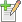
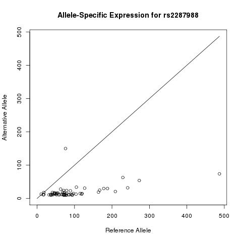

**
Scripts are defined in the Scripts plugin and can be reused, e.g. as part of reports. By default you can find it in the menu under Plugins, Scripts.
The Scripts plugin allows you to create, edit and delete the available scripts.
**

# Create a script
You open the script editor by clicking the add button .

* Name: The name uniquely identifies the script
* Type: The script type determines how the script is executed.
	* R scripts are executed in R
	* Python scripts are executed in Python
	* Magma JavaScript and JavaScript scripts are executed in a JavaScript context
* Content: The actual script content goes here.
* Result file extension: Allows you to render output in your script. For instance, if you set this to `png`, the script will be provided with a parameter `outputFile`. You can write your png image to this file. When the script is done, the contents of the file will be served as a result of the script invocation request.
* Parameters Your script may define parameters that it needs in order to run. **All parameters are of type String**. Multiple scripts can share the same parameter, here you just specify the parameter names.

# Passing parameters

If your Type is R, JavaScript or Python, the Script Content is interpreted as a [Freemarker](http://freemarker.apache.org) template. The parameters are provided as Freemarker variables. You can render them in the script by typing `${parameter}`, but the full Freemarker syntax is at your disposal, so for instance `<#if><#else><#/if>` constructs are also available.

This means that if you want to initialize an R or Python string variable with the value of a parameter string, you'll need to explicitly encapsulate it with quotes.

So in R:

```
# Assign string parameter
name <- "${name}"
# Assign numeric parameter
amount <- ${amount}
```

And in Python:

```
# Assign string parameter
name = "${name}"
# Assign numeric parameter
amount = ${amount}
```

And in JavaScript:

```
// Assign string parameter
var name = "${name}"
// Assign numeric parameter
var amount = ${amount}
```

The script template will be rendered to a file in the File Store and this file will be interpreted using the R or Python interpreter.

##### <a name="passing-script-parameters-magma"></a> Passing parameters to Magma JavaScript
If your Type is [Magma JavaScript](http://wiki.obiba.org/display/OPALDOC/Magma+Javascript+API), the parameters are available through Magma's [$ selector](http://wiki.obiba.org/display/OPALDOC/value+selector+method) method.
JavaScript will have to do the type conversions for you. Or if you want to be sure, you should cast the values explicitly

```
// Assign string parameter
var name = $("name")
// Assign numeric parameter
var amount = int($("amount"))
```

# Security token

Your script can access data inside a MOLGENIS repository through the APIs.
If the data is private data, you can set Generate Security Token to Yes.
Then a molgenis security token will be generated for the user running the script and added as a parameter named `molgenisToken`.
You can pass the token on to the REST API.

## Use security token in R script
Pass the token as a parameter when you request the molgenis.R api script:

```
library('RCurl')
eval(expr = parse(text = getURL("https://molgenis01.target.rug.nl/molgenis.R?molgenis-token=${molgenisToken}")))
molgenis.get("MolgenisUser")
```

# Running a script
You can run your script by pressing the  execute button.
If the script has parameters, you'll be presented with a popup form to specify them.

You can also run the script through an HTTP request.
For instance, to run the `bmi` script with parameters `weight=50` and `height=1.60` on server `http://molgenis09.target.rug.nl` you can surf to [https://molgenis09.target.rug.nl/scripts/bmi/run?weight=50&height=1.60](https://molgenis09.target.rug.nl/scripts/bmi/run?weight=50&height=1.60)

**Beware that you need to URL-encode parameter values if they contain special characters**

# Permissions
Note that in order to execute scripts, users need

* to be authenticated (i.e. anonymous users cannot execute your scripts)
* View permissions on the Scripts entity
* View permissions on the ScriptParameter entity
* View permissions on the ScriptType entity

# Example
Let's take the R script from [the previous example](#example-rest-R) and add it to the Script plugin. The script will fetch the public ASE data from [https://molgenis56.target.rug.nl/](https://molgenis56.target.rug.nl/)

You'll need a running instance of MOLGENIS.
So either run this example locally on your own MOLGENIS instance or Sign Up on our demo server [https://molgenis09.target.rug.nl/](https://molgenis09.target.rug.nl/)

## Create the script

Go to the Script plugin and create a new script.

* Name: Any name will do, as long as it's unique. Since the result will be a plot of Allele-Specific Expression for a SNP, we suggest the name `plot-ase`.
* Type: We're creating an R script, so pick `R`.
* Generate security token: No, since the data is publicly available and lives on a different server anyways.
* Result file extension: R can plot postscript, pdf, png and jpeg. Let's pick `png`.
* Parameters: In the example we plotted one specific ASE, let's make the snp ID a parameter. Select `snp_id`. If it's not yet available you can add it by pushing the **+** button to the right of the select box.

* Content:

```
library('RCurl')
library('methods')
library('bitops')
eval(expr = parse(text = getURL("https://molgenis56.target.rug.nl/molgenis.R")))

samples <- molgenis.get("SampleAse", q="SNP_ID==${snp_id}")
jpeg('${outputFile}')

max <- max(samples$Ref_Counts, samples$Alt_Counts)

plot(samples$Ref_Counts, samples$Alt_Counts, xlim = c(0, max), ylim = c(0, max), xlab='Reference Allele', ylab='Alternative Allele', main = 'Allele-Specific Expression for ${snp_id}')
lines(c(0,max), c(0, max))
dev.off()
```
Note: If you are running this on localhost you might have to install the following packages through Rstudio/R command line;
* install.packages('rjson');
* install.packages('RCurl');
* install.packages('methods');

Let's take a closer look at what happens here.

First we fetch and source the MOLGENIS R API from molgenis56.
This means it'll be set up to retrieve its data from molgenis56.

Then we retrieve the samples using `molgenis.get`.

The `snp_id` parameter gets filled in into the rsql query q.
So if for instance `snp_id` equals `rs2287988`, Freemarker will fill the parameter in where it says `${snp_id}` so the query becomes `q="SNP_ID==rs2287988"`.

The outputFile parameter gets filled in into `jpeg('${outputFile}')` so that R plots to the correct output file.

In [the previous example](#example-rest-R) we manually set the axes to `c(0, 5000)`, but here the amount of reads depends on the chosen SNP. So we compute the maximum amount of reads in both the `Ref_Counts` and `Alt_Counts` attributes of the `samples` dataframe.

Next we create the scatter plot and the reference line, like we did before.
Note how we use the `snp_id` parameter a second time, to render the plot title.

Save the script.

## Call the script
Push the  execute button.

In the popup, specify the value for `snp_id`, for example `rs2287988`.

Push Run.


