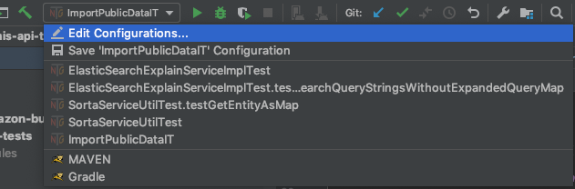
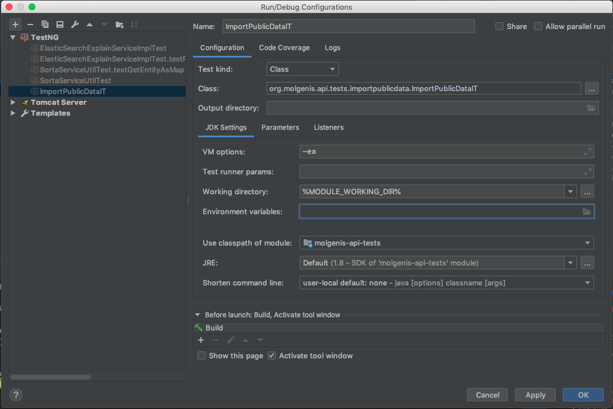
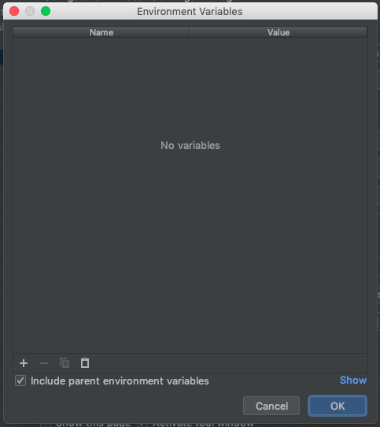
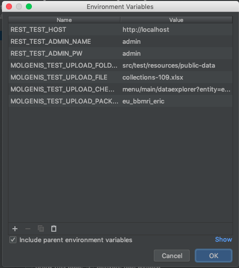

# Molgenis API Test

[](http://www.molgenis.org/jenkins/job/Nightly%20live%20API%20Tests/)

Collection of integration tests to run against a live server. Tests use a java http client to test the molgenis API.

##### Maven properties:

`REST_TEST_HOST=[url_of_live_molgenis_to_test_against]` // default http://localhost:8080  
`REST_TEST_ADMIN_NAME=[name_of_admin_user]` // user name of user that acts as 'admin' user, this user is used to for test setup and teardown  
`REST_TEST_ADMIN_PW=[password_for_admin_users]`

##### Running on local machine:

`mvn test -Dtest=[RestControllerIT,...comma-separated-list-of-test-classes] -DREST_TEST_ADMIN_NAME="[admin_name]" -DREST_TEST_ADMIN_PW="[admin_pw]"` 


### Public data upload test

The class `ImportPublicDataIT` is used as a template for running tests that upload public customer data to live molgenis server. 

The test uploads a file and checks if the upload was successful. After the test has run the imported data is removed using the supplied 
package or list of entities. 

Supported file types: .xlsx and .vcf (make sure the file name is a valid molgenis entity id)

##### Obtain all public data
The data sets are maintained on the [download server](https://molgenis26.gcc.rug.nl/releases/data). You need authentication to access them. You can find the credentials in the Vault.
you need to be able to access the MOLGENIS.

If you want to update the data you can file a request to the datateam for new sets. Be advised that you have to use the same names as before for new sets.

##### Properties and environment variables:
All of the above mentioned maven properties + the following environment variables  
`MOLGENIS_TEST_UPLOAD_FOLDER`  // path to folder to load data files from  
`MOLGENIS_TEST_UPLOAD_FILE`  // file to use in test  
`MOLGENIS_TEST_UPLOAD_PACKAGE_TO_REMOVE`  // optional package to delete after test (success or failure)  
`MOLGENIS_TEST_UPLOAD_ENTITIES_TO_REMOVE` // optional comma separated list of entities to remove after test  (success or failure) 
`MOLGENIS_TEST_UPLOAD_CHECK_URLS`  // comma separated list of urls to test via GET for testing successful upload

##### Run the tests on the commandline.
>note: You have to run MOLGENIS locally to execute the tests.

For Mac and Linux:

- ```molgenis-api-tests/env_export.bash``` 

For Windows execute:
- ```molgenis-api-tests/env_api_tests.bat``` 

>note: make sure you have MAVEN on your PATH for Linux, Mac and Windows

##### Running the tests in IntelliJ
>note: You have to run MOLGENIS locally to execute the tests.

To run the tests in IntelliJ you have to do the following steps:

1. Import test on time to automatically create a runtime configuration
2. Edit runtime configuration

3. Open "Environment variables"

4. Copy all the variables from this file ```molgenis-api-tests/env_export.bash```. 
5. Use the "clipboard"-button to paste the environment into the runtime configuration

6. Click on "Ok" to save the configuration


##### Running on a CI-server

We run separate builds for each individual customer. To add a job for a new customer please check the existing builds. You can copy a job and update the configuration.

**Check CI-jobs**: [](https://jenkins.dev.molgenis.org/job/e2e/). 

**You can modify this job on**: [Github - molgenis-helm](https://github.com/molgenis/molgenis-ops-helm/blob/master/charts/molgenis-jenkins/resources/tests/e2e/Jenkinsfile)


