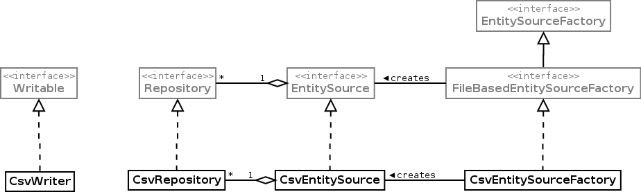

## Introduction

The molgenis-data-csv package is a csv (comma separated values) file backend for Molgenis. It is called molgenis-data-csv but you can specify the separator char. So you can also use it for example tsv (tab separated values). You can use csv files as data backend by registering it but you can also use the package for just reading and writing csv files without registering it as backend.


## Core molgenis-data-csv classes


**The light grey classes are provided by the core molgenis-data module**

### CsvRepository
`Repository` implementation for a csv file. The name of the file without the extension is considered to be the entityname end the first row is considered to contain the attributenames. All attributes are considered to be of type 'string' because there is no way for the user to define it (yet). 


### CsvEntitySource
`EntitySource` that creates `CsvRepositories`. It can be a csv,txt,tsv or zip file. The zipfile must contain csv,txt or tsv files. The name of the repository is the filename without the extension. If it is a zipfile the `CsvEntitySource` has multiple repositories, if not it has one repository.

### CsvWriter
With a `CsvWriter` you can write entities to a csv file.


### Usage examlples
***Read entities from a csv file***

```
Repository repo = new CsvRepository(new File("/Users/test/test.csv"), null);
try
{
	for (Entity entity : repo)
    {
    	System.out.println(entity);
    }
}
finally
{
 	repo.close();
}
```

***Print all csv filenames (entitynames) in a zip file***

```
RepositorySource repositorySource = new CsvRepositorySource(new File("/Users/test/test.zip"));
for (Repository repository : repositorySource.getRepositories())
{
	System.out.println(repository.getName());
}
```

***Register a csv file as data backend***

```
DataService dataService = ...;
dataService.addRepository(new CsvRepository(new File("/Users/test/test.csv"));
```

***Write entities to a csv file***

```
Writable writable = new CsvWriter(new OutputStreamWriter(new FileOutputStream(file), Arrays.asList("col1", col2));
try
{
	Entity entity = new MapEntity();
	entity.set("col1", "val1");
	entity.set("col2", "val2");
	writable.add(entity);
}
finally
{
	writable.close();
}
```

