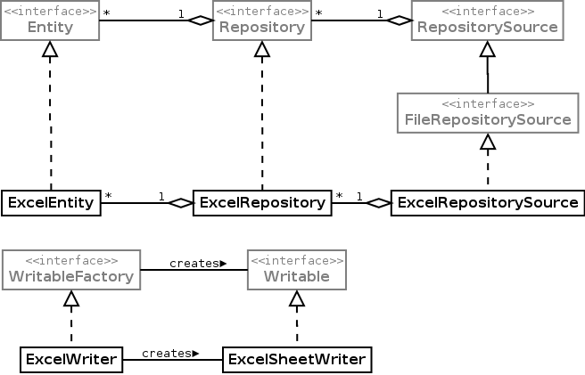

## Introduction

The molgenis-data-excel package is an excel data backend for Molgenis. It is an excel implementation of the data api interfaces. It also provides functionality for just reading and writing excel files without the need to register excel as data backend.

## Core molgenis-data-excel classes


**The light grey classes are provided by the core molgenis-data module**

### ExcelEntity
`Entity` implementation for excel. It represents a row in an excelsheet. 

### ExcelRepository
`Repository` implementation for excel. It represents an excelsheet and acts like an excelsheet reader. The cells in the first row of the excelsheet are considered to contain the attribute names. All the attributes are defined as type 'string' in the metadata because there is no way for the user to define it (yet). The name of the repository is the name of the excel sheet.

### ExcelRepositorySource
`RepositorySource` that holds `ExcelRepositories`. It represents an excel workbook.


### Usage examples
**Print all sheetnames of an excel file**

```
RepositorySource repositorySource = new ExcelRepositorySource(new File("/users/test/test.xls"));
for (Repository repository : repositorySource)
{
	System.out.println(repository.getName());
}
```

**Print all rows (entities) of an excel sheet**

```
RepositorySource repositorySource = new ExcelRepositorySource(new File("/users/test/test.xls"));
Repository repo = entitySource.getRepository("Sheetname");
try
{
	for (Entity entity : repo)
	{
		System.out.println(entity);
	}
}
finally
{
	repo.close();
}
```

**Register an excel file as data backend**

```
DataService dataService = ...;
RepositorySource repositorySource = new ExcelRepositorySource(new File("/users/test/test.xls"));
Repository repo = entitySource.getRepository("Sheetname");
dataService.addRepository(repo);
```

**Create a new excelfile, create a sheet and write entities (rows) to it**

```
WritableFactory writableFactory = new ExcelWriter(new File("/users/test/test.xls"));
try
{
	Writable writable = writableFactory.createWritable("SheetName", Arrays.asList("ColName"));
	try
	{
		writable.add(new MapEntity("ColName", "test"));
		writable.add(new MapEntity("ColName", "qwerty"));
	}
	finally
	{
		writable.close();
	}	
}
finally
{
	writableFactory.close();
}
```
  