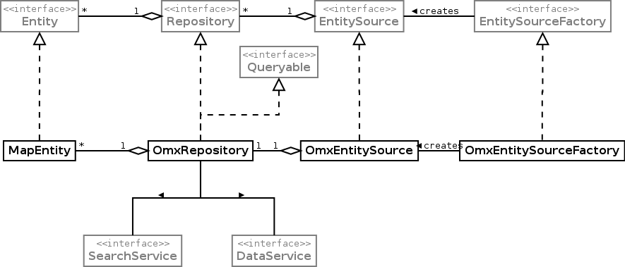

## Introduction
The molgenis-data-omx package is data backend for Molgenis that uses observe omx `DataSet` matrices. It provides repository wrappers around DataSets so that they can be used like any other repository. The attributes of the repository are the `ObservableFeatures` of the `Protocol` used by the `DataSet`. The values of an entity are the `ObservedValues` of an `ObservationSet` that belongs to the `DataSet`. So one `ObservationSet` represents one `Entity`

This package depends on molgenis-omx-core, molgenis-data-jpa and molgenis-search.

## Core molgenis-data-omx classes

 

**The light grey classes are provided by other molgenis modules**

### OmxRepository

`Repository` implementation for an omx `DataSet` matrix. For each `DataSet` there is an `OmxRepository`, the `SearchService` is used to retrieve the attribute values of an entity. So an index needs to be in place to be able to use an `OmxRepository`. The `OmxRepository` uses the `SearchService` for querying and iterating.

The `OmxRepository` methods returns `MapEntities` as the `Entity` implementation. It implements the `Queryable` interface so you can query it but you can't add, update or delete entities with it.

The entitynames are the identifiers of the available `DataSets`. The attributenames are de identifiers of the `ObservableFeatures`.

### OmxEntitySource
There is only one `OmxEntitySource` in an application with url `omx://`. 

### OmxEntitySourceFactory
There can be only one `OmxEntitySourceFactory` in an application, it has the urlprefix `omx://`.

### OmxDataConfig
This is the spring configuration class for the molgenis-data-omx package. It adds the `OmxEntitySource` and `OmxEntitySourceFactory` to the spring applicationcontext and registers the omx entitysource as a databackend at the `DataService`.

So when you import tis class in your configuration class or this class is in the componentscan, you automatically can use the omx data classes.

