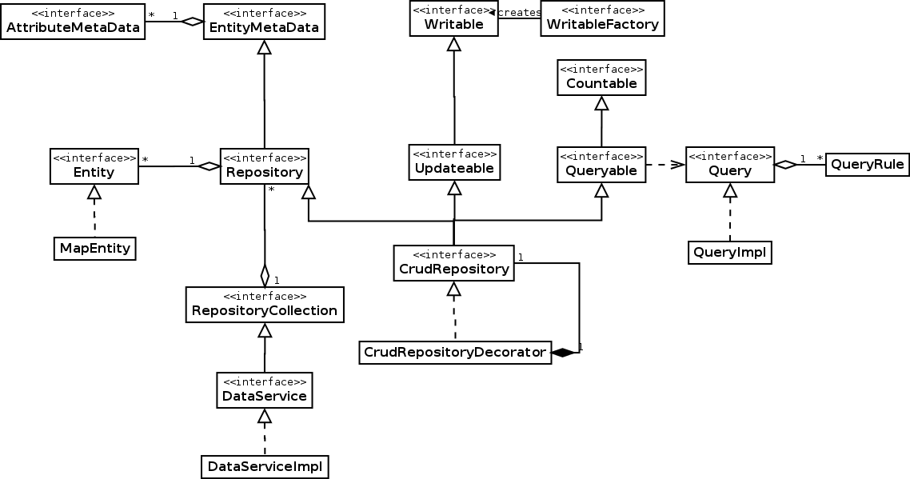

## Introduction

The molgenis data api provides 

* One model for all data backends like 'JPA', 'Excel sheet' and 'OMX DataSet Matrix' 
* A Uniform API to iterate, query, load, update


## Molgenis-data core interfaces and classes



### Entity
An `Entity` is a modeled real world thing that can exist independently and can be uniquely identified (For example a 'Person' or 'Gene'). An entity has 'attributes', the properties of the Entity (For example 'Name' or 'Length'). The `EntityMetaData` interface descibes the Entity and the `AttributeMetaData` interface describes the Attributes. 


### Repository
A repository is a collection of entities. The `Repository` interface describes the most basic form of repository, it only provides an iterator to iterate over the entities it contains. Repositories are homogenic, they contain only one type of entity. Examples of repositories are a database table or an excel sheet.

A `CrudRepository` is capable of doing create/update/delete and is queryable (for example a database table)


### RepositoryCollection
A `RepositoryCollection` is a collection of repositories that you can iterate over.


### EntitySource
A `EntitySource` is a `RepositoryCollection` that is identified by an unique url. Examples are 'an Excel file' or 'a database'. You can create a specific `EntitySource` using an `EntitySourceFactory`.


### Writable / Updateable
You can add write capablilities to you repository by implementing the `Writable` interface. The `Updateable` interface extends `Writable` by adding update capabilities.


### Queryable
If a Repository implmements the `Queryable` interface you can query it using `Query`, the only implementation of this interface is the `QueryImpl` class. The `Query` interfaces uses the builder pattern to build queries.


### DataService
The dataservice is a collection of `EntitySource` and acts as a facade of the data api. Clients of the data api typically only interact with this class. You can add new entitysources to the dataservice by first registering an `EntitySourceFactory`, then you can register an `EntitySource` with a unique url that is understood by the factory.

If you add an `EntitySourceFactory` to the Spring application context it will automatically picked up and be used to create an entitysource and register it by the dataservice.

`DataService` is annotated with the Spring `@Component` annotation so it automatically added to the Spring application context.


## DataService usage examples

	
**Iterate over all entities in a repository:**
	
```
Iterable<Person> persons = dataService.findAll("Person");
for (Person person : persons)
{
	... do something with person
}
```
	
**Find an entity by it's id:**

```
Person person = dataService.findOne("Person", 5);
if (person != null)
{
}
```

**Find entities using a query:**

```
Query query = new QueryImpl().eq("firstName", "Piet"); 
Iterable<Person> persons = dataService.findAll("Person", query);
```

```
Query query = new QueryImpl().eq("firstName", "Piet").and().eq("lastName", "Jansen")
Person person = dataService.findOne("Person" query);
```

**Get a query count:**

```
Query query = new QueryImpl().eq("firstName", "Piet"); 
long count = dataService.count("Person", query);
```

**Get the nr of entities in a queryable repository:**

```
long count = dataService.count("Person", new QueryImpl());
```

**Add an entity to a writable repository:**

```
Person person = new Person();
...
dataService.add("Person", person);
``` 

**Update an entity:**

```
Person person = ...;
dataService.update("Person", person);
``` 

**Delete an entity:**

```
Person person = ...;
dataService.delete("Person", person);
``` 
	
	


 

 

 


